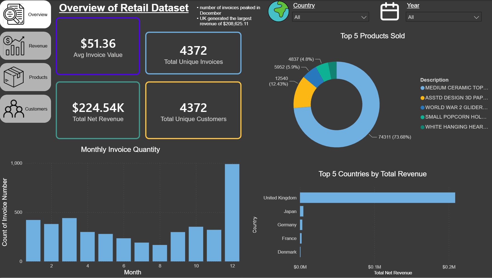
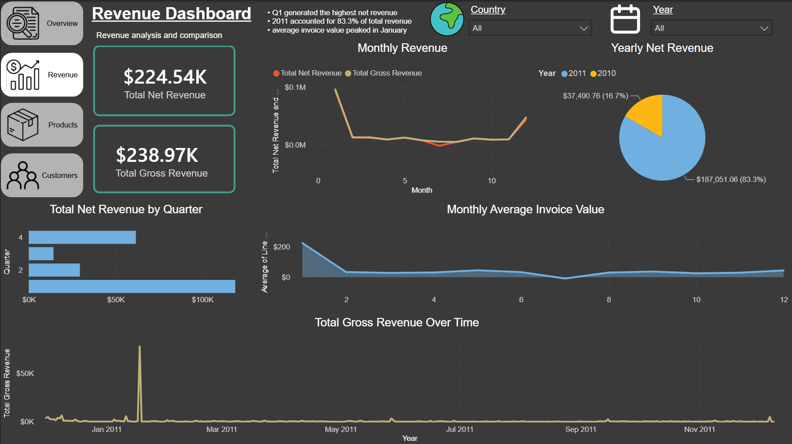
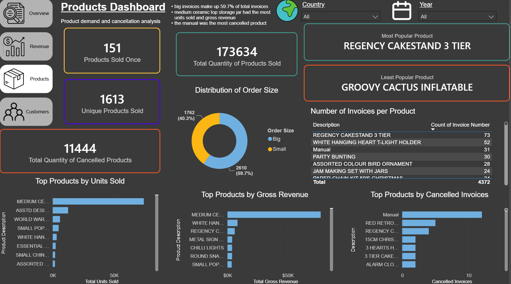
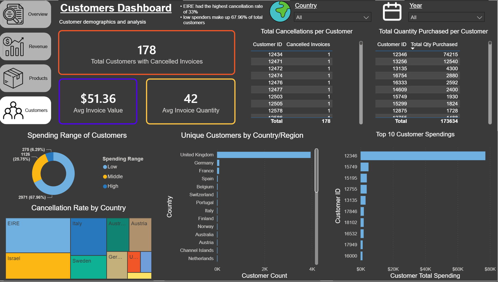
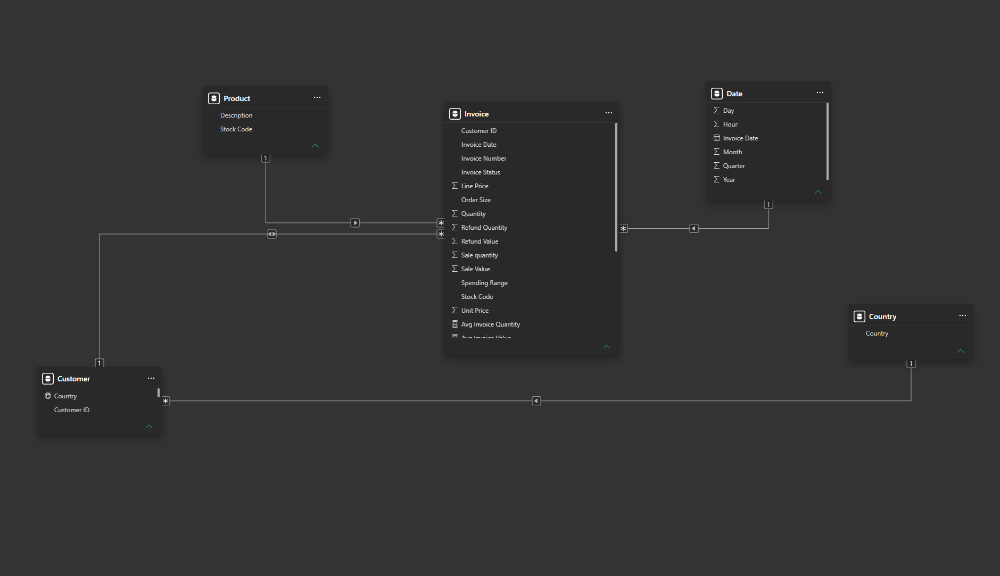

# E-commerce Sales Analytics Dashboard (Power BI)

## Overview

This project analyzes an online retail dataset using Microsoft Power BI.

The dashboard provides interactive insights into:

- Revenue performance
- Product Performance
- Customer behaviors
- Invoice cancellations

## Dashboard Preview 

## Schema Diagram

## Skills Demonstrated 

- Power Query
- Data Cleaning
- Star Schema
- Data Modelling
- DAX measures
- KPI cards
- Top-N Analysis
- Dashboard design

## Dataset
This project was inspired by and developed using the Online Retail (2015) dataset from the UC Irvine Machine Learning Repository.

Dataset citation: Chen, D. (2015). Online Retail [Dataset]. UCI Machine Learning Repository. https://doi.org/10.24432/C5BW33.

## Tools

- Microsoft Power BI
- Power Query
- DAX
